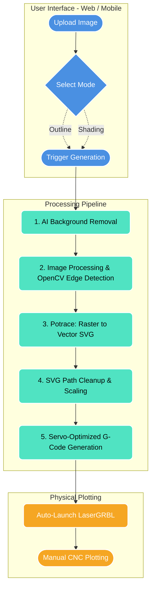

<div align="center">
  <h1> Smart CNC Automated Pen Plotter</h1>
  <p><strong>A fully automated system converting images to CNC-compatible G-code for pen plotters</strong></p>
  
  [](https://www.python.org/)
  [](https://react.dev/)
  [](https://flask.palletsprojects.com/)
  [](#license)
</div>

---

## Project Overview

The **Smart CNC Automated Pen Plotter** simplifies the complex process of turning digital images into physical CNC pen plotter drawings. 

Traditional workflows require piecing together multiple tools (background removers, vectorizers, CAM software). This system automates the entire pipeline—from image selection to optimized G-code generation—using a sleek **React Web Application** and a powerful **Python/Flask backend**. It seamlessly integrates with **LaserGRBL** to instantly load your ready-to-plot files.

## Key Features

- **Automated End-to-End Pipeline**: Upload an image and get plotter-ready G-code instantly.
- **Modern Web Interface**: Beautiful, responsive UI built with React and Glassmorphism design principles.
- **Dual Drawing Modes**:
  - ✒️ **Outline Mode**: Traces the exact contour edges using OpenCV adaptive thresholding to capture fine details (eyes, facial features).
  - 🔲 **Shading / Hatch Mode**: Fills in dark areas with precise diagonal hatching.
- **AI Background Removal**: Integrates with Picsart API for crisp subject isolation.
- **Advanced Image Processing**: Utilizes OpenCV and Pillow for sketch effects, contrast enhancement, and raster-to-vector preparation.
- **Optimized for Pen Plotters**: Generates G-code specifically tuned for servo-based Z-axis control (Pen Up/Down).
- **LaserGRBL Integration**: Automatically launches LaserGRBL and loads the generated G-code for immediate manual execution.

---

## System Workflow



---

## Hardware Requirements

To physically plot the generated G-code, you need:
- **CNC Pen Plotter Frame** (CoreXY, Cartesian, etc.)
- **Stepper Motors** (X and Y Axis)
- **Micro Servo Motor** (Z-Axis / Pen Up & Down Control)
- **Arduino Uno** with **CNC Shield**
- **Stepper Motor Drivers** (e.g., A4988 or DRV8825)
- **Power Supply Unit** (12V)

---

## Tech Stack

- **Frontend (Web)**: React 19, Vite, HTML/CSS
- **Frontend (Mobile)**: React Native, Expo
- **Backend API**: Python, Flask, Flask-CORS
- **Image Processing**: OpenCV (`cv2`), Pillow
- **Vectorization**: Potrace (bundled), `svgpathtools`
- **Machine Control**: LaserGRBL (or Universal G-code Sender)

---

## Installation & Setup

### 1. Clone the Repository
```bash
git clone https://github.com/Junaed93/Smart-CNC.git
cd Smart-CNC
```

### 2. Python Backend Setup
Install the required Python libraries. It is recommended to use a virtual environment.
```bash
pip install -r requirements.txt
```

### 3. API Key Configuration
This project uses the Picsart API for background removal. 
- Create a new file named `.env` in the root directory (or rename `.env.example` to `.env`).
- Add your API key to the `.env` file like this:
  ```env
  PICSART_API_KEY="YOUR_API_KEY_HERE"
  ```

### 4. React Frontend Setup
Navigate into the frontend folder and install the Node packages:
```bash
cd frontend
npm install
```

### 5. Mobile App Setup (Optional)
Navigate into the mobile-app folder and install the Node packages:
```bash
cd mobile-app
npm install
```

---

## Running the Application

You need to run the backend server and your choice of frontend (Web or Mobile) simultaneously in separate terminal windows.

### Start the Backend Server
```bash
python server.py
```
*(Runs on `http://localhost:5000`)*

### Start the Web Frontend UI
Open a new terminal:
```bash
cd frontend
npm run dev
```
*(Runs on `http://localhost:5173`)*

### Start the Mobile App
Open a new terminal:
```bash
cd mobile-app
npm start
```
*(Scan the QR code with Expo Go on your mobile device)*

---

## How to Use

1. Open your preferred frontend (Web or Mobile).
2. **Drag and drop** or browse to select an image file.
3. Select your preferred drawing mode: **Outline** or **Shading**.
4. Click **Generate**.
5. Watch the live Python logs in the UI terminal window.
6. Once processing is complete, **LaserGRBL will launch automatically** with your G-code pre-loaded.
7. Connect your CNC machine in LaserGRBL and manually hit **Play** to start drawing!

---
